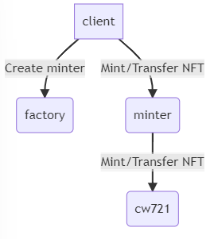

# Artaverse Contract

Artaverse contract is written for the artaverse project, the contract serves to create and manage NFTs. The set includes contracts:

* [Minter](contracts/minter): Minter Contract Customize CW721 according to the logic of the Artaverse project. It manages the config related to NFT
  episode in 1 collection: Base URI, NFT count, minted quantity, etc. and additional information for Royalty.
* [Factory](contracts/factory): Currently, Factory contract only has the simple task of managing the code_id of the related contracts deployed on the
  network. We can instantiate a minter contract via factory contract.

Details and implementations in the contract, please refer to each contract repository.
